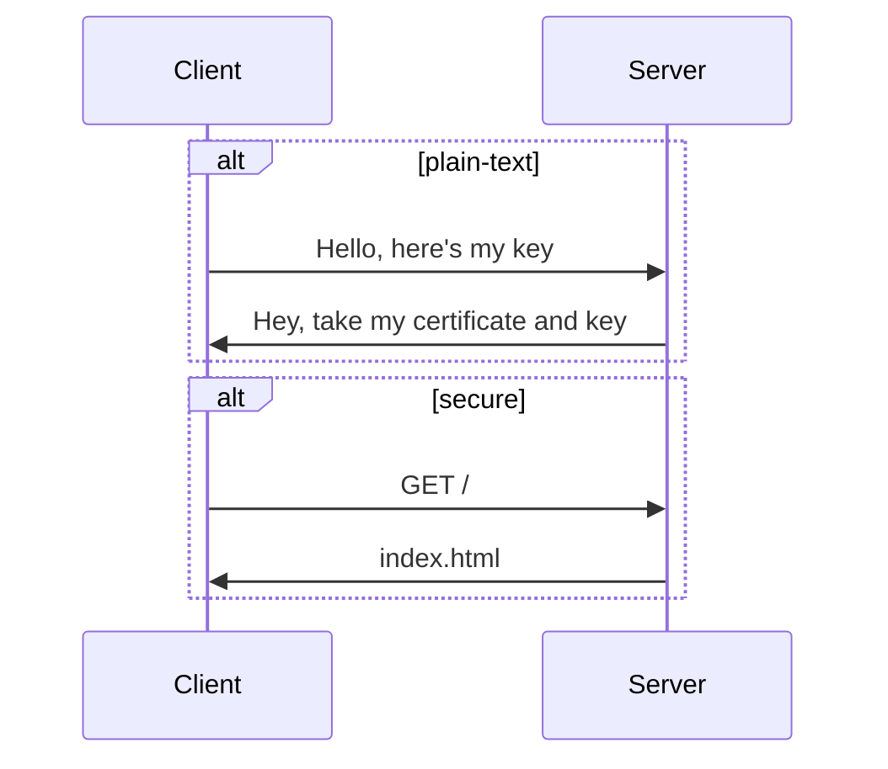

# QUIC enable docker based home server
This is a repo from a perspective of ECE engineer learning the ropes of back-end and internet intricacies.
##  The why?
Resources on the internet are not unified in a way I would have liked. I had to encounter a lot of trial and error and would like others to hopefully find this repo a bit useful.

## HTTPS vs HTTP
Any website with no https will have a insecure warning from all web-browsers. The site is served plain-text. Hacker's dream.  
You might ask "why https even though its just a portfolio website?", see the thing is, if you need people to see your website they need to have a pleasant surfing experience to get to your website. You need HTTPS for that.

## Why HTTP/3 over QUIC, and not HTTP/2 or HTTP1.1 over TLS?
Hand-shakeSSSSSSS. To get your site the average client browser will do these things in order. 
1. PLAIN-TEXT DNS request to ISP. 
2. DNS records in response.
3. TCP SYN to server.
4. TCP SYN ACK response.
5. TCP ACK to server.
6. TLS Client Hello to server
7. TLS Server Cert response. (Browser verifies the cert in background)
8. TLS Client cipher exchange to server.
9. TLS Server cipher exchange to client.
10. The HTTP/2 or HTTP/1.x GET / request to server.
11. The initial index.html as response.
12. GET /favicon.ico request to server.
13. favicon image response.
and then->
- each asset will have a GET.
- and subsequent response.

So in average 16 or more flights of requests to get a single page, the first time you visit the browser. 
The server is verified for the time until you close the tab (or till some timeout).  

In the case of quic we have a big change, we use UDP, so no SYNACK BS.
And with it we have, some basic optimizations such as, Streams from HTTP/2, and a combined QUIC handshake.
Here is a simple flow chart:

